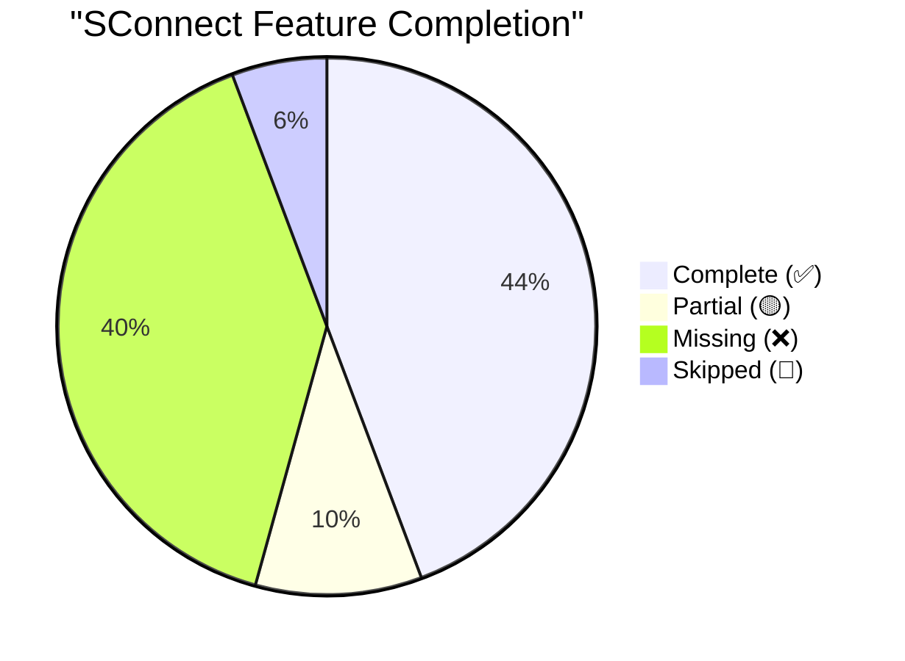

# SConnect vs Official Suzuki App — Feature Parity Analysis

> Comprehensive comparison between the decompiled official Suzuki Ride Connect application and the open-source SConnect project.

---

---

## 📊 Feature Parity Progress

---

## Executive Summary

The official Suzuki app contains **~45+ screens/activities** spanning vehicle management, telemetry, navigation, service scheduling, and social/content features. SConnect currently covers **~18 core activities** including BLE connectivity, navigation service, trip recording, last parked location, fuel charts, and service reminders. The overall feature parity is estimated at **~52%**.

---

## Feature Parity Matrix

### 🟢 Legend

| Symbol | Meaning |
|:---:|:---|
| ✅ | Feature complete and stable |
| 🟡 | Partially implemented |
| ❌ | Not implemented |
| 🚫 | Intentionally skipped (proprietary/irrelevant) |

---

### 1. 🔵 BLE & Connectivity Layer

| # | Feature | Official App | SConnect | Parity | Notes |
|:---:|:---|:---|:---|:---:|:---|
| 1.1 | BLE Scan & Discovery | `DeviceListingScanActivity` — Scans, filters Suzuki devices, matches by VIN pattern | `SuzukiBleScanner` — Scans and lists BLE devices | ✅ | SConnect has equivalent scan logic |
| 1.2 | BLE Connection & GATT | `MyBleService` — Full GATT service with FastBLE, auto-reconnect, EventBus events | `BleConnectionService` + `SuzukiGattCallback` — Foreground service with manual GATT | ✅ | Core connection is stable |
| 1.3 | Vehicle-Specific Filtering | Identifies vehicle model from BLE advertisement data (VIN parsing, byte 5-11) | Basic device listing, no VIN-based filtering | 🟡 | SConnect connects but doesn't auto-identify model |
| 1.4 | Auto-Reconnect on Disconnect | Uses EventBus `onConnectionEvent`, periodic retry timers | Reconnect logic in `BleConnectionService` | ✅ | Functional |
| 1.5 | Connection Status Broadcast | Broadcasts `status` intent across all activities | Handled internally within service | ✅ | Different approach, same result |

---

### 2. 🟢 Vehicle Telemetry & Dashboard

| # | Feature | Official App | SConnect | Parity | Notes |
|:---:|:---|:---|:---|:---:|:---|
| 2.1 | Odometer Display | Parsed from `?7` packet bytes 5-11 | Parsed in `SuzukiPacketParser` | ✅ | Working |
| 2.2 | Trip A / Trip B | Parsed from cluster response packet | Parsed in `SuzukiPacketParser` | ✅ | Working |
| 2.3 | Fuel Level | Parsed from cluster response | Parsed in `SuzukiPacketParser` | ✅ | Working |
| 2.4 | Gear Position | Parsed from packet byte, displays N/1/2/3/4/5 | Fixed in conv `f7f65c29` — handled binary/ASCII auto-detection | ✅ | Fully functional |
| 2.5 | Fuel Consumption Calc | `HomeScreenActivity.onClusterDataRecev()` — Complex real-time km/l calculation from bytes 25-27 | Implemented in `SuzukiPacketParser` (13/11-bit split formula) | ✅ | Integrated with `BleConnectionService` |
| 2.6 | Real-time Speed | Investigated in conv `1c7998f1` — speed not in `?7` packet | Both: No speed data from cluster | ✅ | Same limitation in both |
| 2.7 | Last Synced ODO Storage | Stores last synced ODO in SharedPrefs per vehicle | Implemented in `VehicleStateHolder` using SharedPrefs | ✅ | Persists across app restarts |
| 2.8 | e-ACCESS / EV Telemetry | Separate energy consumption logic (`Energy Consumption` vs `Fuel Consumption`) | Not implemented | ❌ | Only relevant for e-ACCESS scooter |

---

### 3. 🧭 Navigation

| # | Feature | Official App | SConnect | Parity | Notes |
|:---:|:---|:---|:---|:---:|:---|
| 3.1 | Route Search / Autosuggest | `RouteActivity` — Full Mappls autosuggest with search UI, recent/favourite locations | `RouteSelectionActivity` — Mappls autosuggest search | ✅ | Core search works |
| 3.2 | Route Calculation & Display | Full polyline drawing, multiple route options, ETA display | Route display via Mappls Directions | ✅ | Working |
| 3.3 | Turn-by-Turn Navigation | Mappls Navigation SDK, maneuver events sent to cluster via BLE | `NavigationSession` + `SuzukiPacketBuilder` — TBT data sent to cluster | ✅ | Core TBT working |
| 3.4 | Maneuver → Cluster Icon Map | `w0.java` — Comprehensive mapping of 40+ Mappls maneuver IDs to Suzuki icons | `SuzukiPacketBuilder` — Expanded in conv `33e2d442` | ✅ | Verified against decompiled in conv `33e2d442` |
| 3.5 | Roundabout Exit Angles | Original handles roundabout with angle-based exit logic | `RoundaboutAngleCalculator` added in conv `c60dcc9b` | ✅ | Implemented |
| 3.6 | Navigation Handshake (`?6`) | Sends 5x identification packets before navigation data starts | Fixed in conv `a0df56d4` | ✅ | Working |
| 3.7 | Heartbeat Packets | Periodic heartbeat with real speed/signal data | Speed from last `?7` cluster packet; signal from `PhoneStateListener` → cluster values 0–3 | ✅ | Implemented in `BleConnectionService` |
| 3.8 | Auto-Reroute | Detects deviation from route, triggers automatic reroute | Added rerouting trigger in conv `ed691052` | ✅ | Implemented |
| 3.9 | Camera Follow GPS | Map camera automatically tracks user position | Camera follow logic added in conv `ed691052` | ✅ | Implemented |
| 3.10 | Airplane Mode Detection | Detects airplane mode, adjusts navigation behavior | Bug identified in conv `c60dcc9b`, fix planned | 🟡 | Known gap |
| 3.11 | GPS Provider Check | Handles GPS disable gracefully | Identified in conv `c60dcc9b` | 🟡 | Partially handled |
| 3.12 | Navigation as Service | Official runs navigation data send as background-safe logic | Migrated to Foreground `NavigationService` in conv `900011a1` | ✅ | Stable background navigation |
| 3.13 | Route with Nearby Search | `RouteNearByActivity` — Nearby POI (fuel, food, etc.) along route | Not implemented | ❌ | |
| 3.14 | Trip Recording | `TripActivity` + `TripDetailsActivity` — Records rides with Recent/Favourites, stores in Realm DB | `TripHistoryActivity` + `TripRecord` — Persistent trip logging | ✅ | Implemented with Realm DB |
| 3.15 | Trip Details / Replay | View past trip details including route on map | `TripDetailActivity` — Shows route, stats, and time | ✅ | Working |
| 3.16 | Navigation Device Selection | `NavigationDeviceListingActivity` — Select which cluster to pair for nav | Not needed (single device) | 🚫 | Simplified architecture |
| 3.17 | Text-to-Speech | `HomeScreenActivity.a0` — Voice guidance using Android TTS | Not implemented | ❌ | |

---

### 4. 📊 Fuel Economy & Analytics

| # | Feature | Official App | SConnect | Parity | Notes |
|:---:|:---|:---|:---|:---:|:---|
| 4.1 | Daily Fuel Consumption Chart | `FuelConsumptionActivity` — Tabs: DAILY / MONTHLY, MPChart combined charts | Integrated MPAndroidChart with `DailyFuelRecord` Realm model | ✅ | Implemented in `FuelEconomyActivity` |
| 4.2 | Fuel Economy Average | `FuelEconomyAverageActivity` — Daily, weekly, monthly averages with combined bar+line charts | Implemented average calculations in `FuelChartFragment` | ✅ | Visual data analysis |
| 4.3 | Fuel Data Storage | Realm DB models: `j.class` (daily), `q.class` (monthly), `C.class` (weekly) | Persistent storage using `DailyFuelRecord` Realm model | ✅ | Time-series telemetry storage |
| 4.4 | Mileage Tracking | Calculated from ODO + fuel consumption packets | Calculated in `SuzukiPacketParser` | ✅ | |

---

### 5. 🔧 Service & Maintenance

| # | Feature | Official App | SConnect | Parity | Notes |
|:---:|:---|:---|:---|:---:|:---|
| 5.1 | Periodic Vehicle Service | `PeriodicVehicleServiceActivity` — Full service scheduler with date picker, km entry, notification snooze | Implemented `ServiceRemindersActivity` with custom intervals | ✅ | Core service tracking |
| 5.2 | Service Parameters | Different service items per vehicle type (Scooter vs Motorcycle vs EV) with specific intervals | Fixed intervals implemented | 🟡 | Model-specific logic pending |
| 5.3 | Service Notifications | AlarmManager-based scheduled reminders with snooze/dismiss | Back-end logic using `ServiceReminderWorker` and `WorkManager` | ✅ | Battery-efficient notifications |
| 5.4 | Ideal Service Params | `IdealParamActivity` — Shows recommended service parameters image | Not implemented | ❌ | Simple info screen |
| 5.5 | Service Notification History | `NotificationHistoryActivity` — Shows all past service notifications | Not implemented | ❌ | |

---

### 6. 🏍 Vehicle / Profile Management

| # | Feature | Official App | SConnect | Parity | Notes |
|:---:|:---|:---|:---|:---:|:---|
| 6.1 | Create Profile | `CreateProfileActivity` — Full onboarding with vehicle type/model selection, color picker | Not implemented | ❌ | Supports 10+ models with color variants |
| 6.2 | Add Vehicle | `AddVehicleActivity` — Add multiple vehicles with model + color selection | Not implemented | ❌ | |
| 6.3 | Digital Wallet (Vehicle Garage) | `DigitalWalletActivity` — Manage multiple vehicles, set primary, delete with confirmation | Not implemented | ❌ | 1400-line activity with Realm DB |
| 6.4 | Profile View/Edit | `ProfileActivity` — User profile with photo, name, location, vehicle color swiper | Not implemented | ❌ | Uses `CircleImageView`, ViewPager for colors |
| 6.5 | Rider Profile | `RiderProfileActivity` — Separate rider-specific profile | Not implemented | ❌ | |
| 6.6 | Color Change | `ColorChangeActivity` — Change vehicle color with reverse geocode | Not implemented | ❌ | |
| 6.7 | Profile Image | Camera/gallery picker with Base64 storage in SharedPrefs | Not implemented | ❌ | |
| 6.8 | Vehicle Image Gallery | Per-model vehicle images (10 models × multiple colors = 70+ drawables) | Not implemented | ❌ | |

---

### 7. 🗺 Location Features

| # | Feature | Official App | SConnect | Parity | Notes |
|:---:|:---|:---|:---|:---:|:---|
| 7.1 | Last Parked Location | `LastParkedLocationActivity` — Records lat/lng on BLE disconnect, shows on map with directions | `LastParkedLocationActivity` — Full map + auto-save on disconnect | ✅ | Implemented |
| 7.2 | Location Share | Share last parked location via Android share intent | `shareLocation()` via Android Share Intent | ✅ | Implemented |
| 7.3 | Walk-to-Bike Navigation | Walking directions from current location to parked bike (< 500m) | Smart routing: Walking (<500m) vs Biking (>500m) | ✅ | Implemented |

---

### 8. 📱 Notifications & Communication

| # | Feature | Official App | SConnect | Parity | Notes |
|:---:|:---|:---|:---|:---:|:---|
| 8.1 | Incoming SMS Display | `IncomingSms` — Intercepts SMS, sends caller name + message to cluster display | `AppNotificationService` — Notification listener | 🟡 | SConnect uses NotificationListenerService approach |
| 8.2 | Incoming Call Display | Detects incoming calls, shows caller info on cluster | `AppCallReceiver` — Broadcast receiver for calls | 🟡 | Basic implementation exists |
| 8.3 | Contact Name Resolution | Resolves phone number to contact name from ContactsContract | Handled in notification service | 🟡 | Partially implemented |

---

### 9. 📖 Help & Information

| # | Feature | Official App | SConnect | Parity | Notes |
|:---:|:---|:---|:---|:---:|:---|
| 9.1 | FAQ | `FaqActivity` + `FaqOptionsActivity` + `FaqDescriptionActivity` — Multi-level FAQ with tabs | Not implemented | ❌ | |
| 9.2 | Help / User Guide | `HelpActivity` + `UserguideActivity` — Context-specific help screens | Not implemented | ❌ | |
| 9.3 | User Manual Download | `UserManualActivity` — WebView with PDF download capability | Not implemented | ❌ | |
| 9.4 | About Us | `AboutUsActivity` — App info and version | Not implemented | ❌ | |
| 9.5 | Privacy Policy | `PrivacyActivity` — Legal/privacy content | Not implemented | ❌ | |
| 9.6 | Terms & Conditions | `TermsActivity` | Not implemented | ❌ | |

---

### 10. 💳 Subscription & Payments (Proprietary)

| # | Feature | Official App | SConnect | Parity | Notes |
|:---:|:---|:---|:---|:---:|:---|
| 10.1 | Subscription Plans | `SubscriptionPlanDetailsActivity` + `SubscriptionPlanDetailsActivityNew` | Not applicable | 🚫 | Proprietary subscription model |
| 10.2 | Payment Processing | `PaymentSucessActivity` + `ActivateYourPlanActivity` | Not applicable | 🚫 | Not relevant to open source |
| 10.3 | Digital Wallet Auth | `DigitalWalletAuthentication` + `DigitalWalletDocumentActivity` | Not applicable | 🚫 | Suzuki-specific |

---

### 11. 🎨 UX / App Shell

| # | Feature | Official App | SConnect | Parity | Notes |
|:---:|:---|:---|:---|:---:|:---|
| 11.1 | Splash Screen | `SplashActivity` + `SplashFirst` + `SplashScreenSecond` — 3-step onboarding | Not implemented | ❌ | |
| 11.2 | Intro Screens | `IntroscreenActivity` — First-time user walkthrough | Not implemented | ❌ | |
| 11.3 | Bottom Navigation | `BottomNavigationView` with 4 tabs: Dashboard, Settings, Map, More | `MainActivity` with basic layout | 🟡 | Functional but basic |
| 11.4 | Dark Mode Support | Full dark mode with separate drawables and color theming | Not implemented | ❌ | Official has EV-specific dark mode variants too |
| 11.5 | e-ACCESS EV Theme | Separate green/EV color scheme and icons for electric model | Not implemented | ❌ | |
| 11.6 | Feedback / Rating Dialog | `FeedbackActivity` + rating dialog with star rating + comments | Not implemented | ❌ | |
| 11.7 | App Rating Prompt | In-app rating prompt after connection | Not implemented | ❌ | |
| 11.8 | Exit Confirmation | Bottom sheet dialog with custom branding on back press | Not implemented | ❌ | |

---

## 📊 Parity Summary

| Category | Total Features | ✅ Complete | 🟡 Partial | ❌ Missing | 🚫 Skipped |
|:---|:---:|:---:|:---:|:---:|:---:|
| **BLE & Connectivity** | 5 | 4 | 1 | 0 | 0 |
| **Vehicle Telemetry** | 8 | 7 | 0 | 1 | 0 |
| **Navigation** | 17 | 12 | 2 | 2 | 1 |
| **Fuel Economy** | 4 | 4 | 0 | 0 | 0 |
| **Service & Maintenance** | 5 | 2 | 1 | 2 | 0 |
| **Vehicle/Profile Mgmt** | 8 | 0 | 0 | 8 | 0 |
| **Location Features** | 3 | 3 | 0 | 0 | 0 |
| **Notifications** | 3 | 0 | 3 | 0 | 0 |
| **Help & Information** | 6 | 0 | 0 | 6 | 0 |
| **Subscription** | 3 | 0 | 0 | 0 | 3 |
| **UX / App Shell** | 8 | 0 | 1 | 7 | 0 |
| **TOTAL** | **70** | **31** | **7** | **28** | **4** |

> **Overall Parity: ~52.3%** (counting partial as 0.5) — **34.5/66 effective features** (excluding proprietary)

---

## 🎯 Prioritized Implementation Roadmap

Based on rider value, technical feasibility, and community demand:

### Tier 1 — High Impact, Core Experience *(Completed ✅)*

| Priority | Feature | Effort | Status | Why |
|:---:|:---|:---:|:---:|:---|
| **P0** | Fix Gear Display Bug (#2.4) | Low | ✅ | Fixed binary/ASCII edge cases |
| **P1** | Last Parked Location (#7.1) | Medium | ✅ | Integrated map + sharing |
| **P2** | Trip Recording & History (#3.14, #3.15) | Medium | ✅ | Realm DB storage implemented |
| **P3** | Fuel Consumption Calculation (#2.5) | Medium | ✅ | 13/11-bit telemetry parsing |
| **P4** | Navigation Service (#3.12) | Medium | ✅ | Migrated from Activity to Foreground Service |
| **P5** | Fuel Economy Charts (#4.1, #4.2) | High | ✅ | Integrated MPAndroidChart |
| **P7** | Service Reminders (#5.1) | High | ✅ | Implemented scheduler + notifications |
| **P15** | Vehicle Data Persistence (#2.7) | Low | ✅ | `VehicleStateHolder` with SharedPrefs |

### Tier 2 — Differentiation Features *(Medium Term)*

| Priority | Feature | Effort | Why |
|:---:|:---|:---:|:---|
| **P6** | Dark Mode (#11.4) | Medium | Modern UX expectation |
| **P9** | Splash + Onboarding (#11.1, 11.2) | Low | First impression polish |

### Tier 3 — Polish & Completeness *(Long Term)*

| Priority | Feature | Effort | Why |
|:---:|:---|:---:|:---|
| **P8** | Vehicle Profile & Garage (#6.1-6.4) | High | Multi-vehicle support |
| **P9** | Splash + Onboarding (#11.1, 11.2) | Low | First impression polish |
| **P10** | Nearby POI on Route (#3.13) | Medium | Fuel station finder |
| **P11** | TTS Voice Guidance (#3.17) | Low | Hands-free safety feature |

### Tier 4 — AI & Innovation *(Roadmap — Already Planned)*

| Priority | Feature | Effort | Why |
|:---:|:---|:---:|:---|
| **P12** | Predictive Maintenance Narrator | Very High | Differentiator from official app |
| **P13** | Rider-Centric Routing | Very High | Weather + wind awareness |
| **P14** | Fuel Strategist | Very High | Dynamic range estimation |

---

## Key Technical References

| File | Purpose |
|:---|:---|
| [HomeScreenActivity.java](file:///home/bhaskar/Kiro/s-connect/decompiled_source/sources/com/suzuki/activity/HomeScreenActivity.java) | Main dashboard, fuel calculation, bottom nav |
| [NavigationActivity.java (official)](file:///home/bhaskar/Kiro/s-connect/decompiled_source/sources/com/suzuki/activity/NavigationActivity.java) | Official navigation with trip recording |
| [LastParkedLocationActivity.java](file:///home/bhaskar/Kiro/s-connect/decompiled_source/sources/com/suzuki/activity/LastParkedLocationActivity.java) | Last parked with map + walking directions |
| [PeriodicVehicleServiceActivity.java](file:///home/bhaskar/Kiro/s-connect/decompiled_source/sources/com/suzuki/activity/PeriodicVehicleServiceActivity.java) | Service scheduling with model-specific intervals |
| [FuelEconomyAverageActivity.java](file:///home/bhaskar/Kiro/s-connect/decompiled_source/sources/com/suzuki/activity/FuelEconomyAverageActivity.java) | Daily/weekly/monthly fuel charts |
| [DigitalWalletActivity.java](file:///home/bhaskar/Kiro/s-connect/decompiled_source/sources/com/suzuki/activity/DigitalWalletActivity.java) | Multi-vehicle garage management |
| [ProfileActivity.java](file:///home/bhaskar/Kiro/s-connect/decompiled_source/sources/com/suzuki/activity/ProfileActivity.java) | User profile with vehicle color picker |
